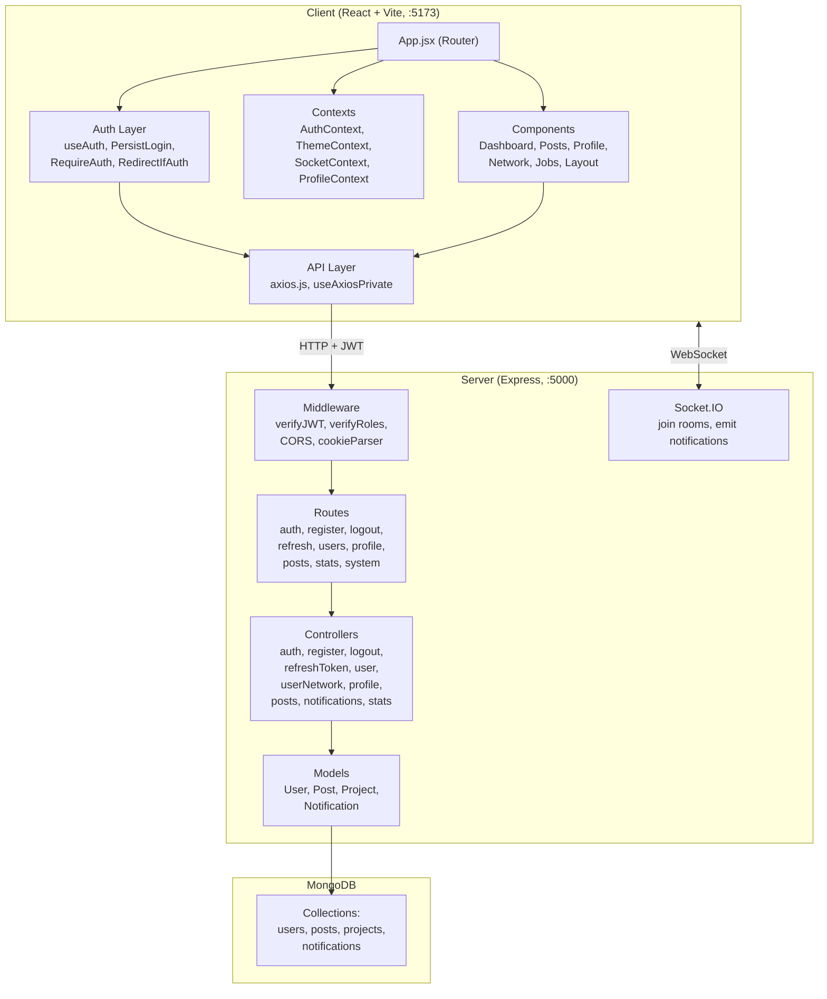
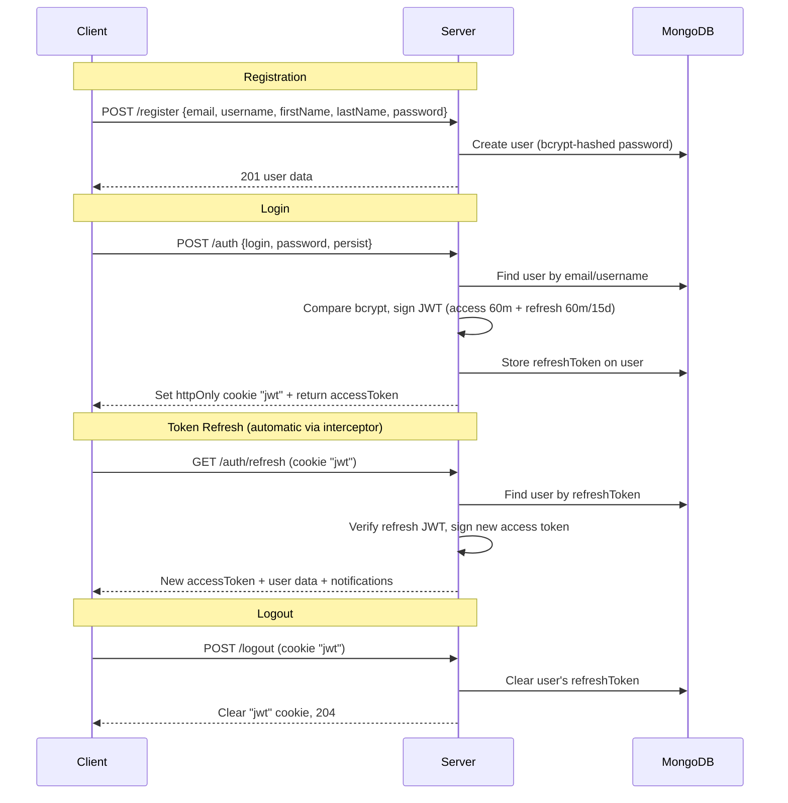

# Vlogverse — Project Walkthrough

## Overview
Vlogverse is a **full-stack developer social platform** — essentially a mini LinkedIn/Twitter hybrid for developers. Users can register, create blog posts, follow each other, manage profiles, and receive real-time notifications.

---

## Tech Stack

| Layer | Technology |
|---|---|
| **Frontend** | React 18, Vite, React Router v6 |
| **Styling** | Tailwind CSS 3 + DaisyUI (dim/nord themes) |
| **Animations** | Framer Motion |
| **HTTP** | Axios (with interceptors for auto-refresh) |
| **Realtime** | Socket.IO Client |
| **Backend** | Node.js, Express 4 |
| **Database** | MongoDB via Mongoose 8 |
| **Auth** | JWT (access + refresh tokens, httpOnly cookies) |
| **Realtime** | Socket.IO (server) |
| **Validation** | `validator` library, custom regex |

---

## Architecture



---

## Data Models

### User ([User.js](file:///c:/Users/ASUS/Desktop/vlogverse/server/models/User.js))
Core user model that doubles as the profile. Contains:
- **Auth fields**: email, username, firstName, lastName, password, role (`user|moderator|admin|owner`), refreshToken
- **Profile fields**: bio, location, skills[], avatar, website, github, linkedin, otherWebsite
- **Relations**: notifications[], following[], followers[], network[], posts[], projects[]

### Post ([Post.js](file:///c:/Users/ASUS/Desktop/vlogverse/server/models/Post.js))
Blog posts with social features:
- body, media (images/videos), tags[], featured flag
- author (→User), likes[], comments[] (embedded subdocument with author+text), repostedBy[], shareCount

### Project ([Project.js](file:///c:/Users/ASUS/Desktop/vlogverse/server/models/Project.js))
Portfolio projects:
- title, description, media, tags, techStack[], liveLink, sourceCodeLink, slug, owner (→User)

### Notification ([Notification.js](file:///c:/Users/ASUS/Desktop/vlogverse/server/models/Notification.js))
Real-time notifications:
- type (follow|like|comment|mention|repost|share|custom), from→User, to→User, message, data (mixed), read flag

---

## Authentication Flow



- **Access token**: 60 min expiry, sent in `Authorization: Bearer` header
- **Refresh token**: 60 min (default) or 15 days (persist mode), stored in httpOnly cookie
- **Client interceptor** ([useAxiosPrivate](file:///c:/Users/ASUS/Desktop/vlogverse/client/src/auth/useAxiosPrivate.jsx)): auto-attaches Bearer token; on 403, silently refreshes and retries once

---

## API Routes

| Method | Route | Auth | Controller | Purpose |
|---|---|---|---|---|
| POST | `/register` | ✗ | registerController | Create account |
| POST | `/auth` | ✗ | authController | Login |
| GET | `/auth/verify` | JWT | inline | Verify token |
| GET | `/auth/refresh` | Cookie | refreshTokenController | Refresh access token |
| POST | `/logout` | Cookie | logoutController | Logout |
| GET | `/api/users` | JWT+Role | userController | List all users |
| POST | `/api/users` | JWT+Admin | userController | Create user (admin) |
| PUT | `/api/users/:id` | JWT+Admin | userController | Update user (admin) |
| DELETE | `/api/users/:id` | JWT+Admin | userController | Delete user (admin) |
| GET | `/api/users/username/:username` | ✗ | userController | Lookup by username |
| GET | `/api/users/email/:email` | ✗ | userController | Lookup by email |
| POST | `/api/users/follow/:id` | JWT+Role | userNetworkController | Toggle follow |
| GET | `/api/users/followers` | JWT+Role | userNetworkController | List followers |
| GET | `/api/users/following` | JWT+Role | userNetworkController | List following |
| GET | `/profile/:username` | JWT | profileController | View profile |
| PUT | `/profile/:username` | JWT | profileController | Update profile |
| GET | `/api/posts` | JWT+Role | postsController | List posts (paginated, filtered by userIds) |
| POST | `/api/posts` | JWT+Role | postsController | Create post |
| GET | `/api/posts/:id` | JWT+Role | postsController | Get single post |
| PUT | `/api/posts/:id` | JWT+Role | postsController | Edit post |
| DELETE | `/api/posts/:id` | JWT+Role | postsController | Delete post |
| PATCH | `/api/posts/:id/like` | JWT+Role | postsController | Toggle like |
| POST | `/api/posts/:id/comments` | JWT+Role | postsController | Add comment |
| DELETE | `/api/posts/:id/comments/:commentId` | JWT+Role | postsController | Delete comment |

---

## Client Architecture

### Context Providers (wrapping order in `main.jsx`)
1. **ThemeProvider** — dark/light mode via DaisyUI themes (dim/nord), persisted in localStorage
2. **AuthProvider** — holds `auth` state (user info + accessToken) and `persist` flag
3. **SocketProvider** — creates Socket.IO connection to `:5000`, auto-joins user's room on login
4. **BrowserRouter** — React Router

### Routing ([App.jsx](file:///c:/Users/ASUS/Desktop/vlogverse/client/src/App.jsx))

| Route | Component | Access |
|---|---|---|
| `/` , `/login` | Login | Public (redirects if authenticated) |
| `/register` | Register | Public (redirects if authenticated) |
| `/dashboard` | Dashboard | Protected (all roles) |
| `/profile/:username` | Profile | Protected |
| `/profile/:username/edit` | EditProfile | Protected |
| `/blogs` | Posts | Protected |
| `/jobs` | Jobs | Protected |
| `/network` | Network | Protected |
| `/unauthorized` | Unauthorized | Public |
| `*` | NotFound | Public |

### Key Client Components

| Component | Size | Purpose |
|---|---|---|
| [NavBar.jsx](file:///c:/Users/ASUS/Desktop/vlogverse/client/src/components/layout/NavBar.jsx) | 17.6 KB | Navigation bar with notifications, theme toggle |
| [Posts.jsx](file:///c:/Users/ASUS/Desktop/vlogverse/client/src/components/posts/Posts.jsx) | 12.5 KB | Blog feed with infinite pagination |
| [EditProfile.jsx](file:///c:/Users/ASUS/Desktop/vlogverse/client/src/components/profile/EditProfile.jsx) | 23.9 KB | Comprehensive profile editor |
| [Profile.jsx](file:///c:/Users/ASUS/Desktop/vlogverse/client/src/components/profile/Profile.jsx) | 10.9 KB | Public profile view |
| [CreatePost.jsx](file:///c:/Users/ASUS/Desktop/vlogverse/client/src/components/posts/CreatePost.jsx) | 10.3 KB | Post creation form |
| [Register.jsx](file:///c:/Users/ASUS/Desktop/vlogverse/client/src/components/subcomponents/Register.jsx) | 12.9 KB | Registration form with validation |
| [Login.jsx](file:///c:/Users/ASUS/Desktop/vlogverse/client/src/components/subcomponents/Login.jsx) | 10.3 KB | Login form |
| [Dashboard.jsx](file:///c:/Users/ASUS/Desktop/vlogverse/client/src/components/Dashboard/Dashboard.jsx) | 2.7 KB | Main dashboard with activity, blogs, events |

---

## Realtime (Socket.IO)

- **Server** ([socket.js](file:///c:/Users/ASUS/Desktop/vlogverse/server/socket.js)): Initializes Socket.IO, listens for `join` events where users join a room keyed by their userId
- **Client** ([SocketContext.jsx](file:///c:/Users/ASUS/Desktop/vlogverse/client/src/context/SocketContext.jsx)): Connects on mount, emits `join` with `auth.id`
- **Notifications Controller** ([notificationsController.js](file:///c:/Users/ASUS/Desktop/vlogverse/server/controllers/notificationsController.js)): Uses `io.to(userId).emit('new-notification', ...)` and `'remove-notification'` for live push

---

## Security Features

- **Password hashing**: bcrypt with 10 salt rounds
- **XSS prevention**: `validator.escape()` on post body and bio
- **Input validation**: Regex patterns for names, usernames, emails, URLs, locations
- **RBAC**: 4-tier role system (user → moderator → admin → owner) with middleware enforcement
- **CORS**: Whitelisted origins with credentials support
- **Token rotation**: Refresh tokens stored in httpOnly cookies, cleared on logout

---

## Development Status (from [TODO.md](file:///c:/Users/ASUS/Desktop/vlogverse/server/TODO.md))

| Feature | Status |
|---|---|
| Core setup | ✅ Complete |
| User authentication | ✅ Complete |
| Profiles | ✅ Complete |
| Blog posts (CRUD + likes/comments) | ✅ Complete |
| Admin panel | ✅ Mostly complete (dashboard analytics pending) |
| Networking (follow/unfollow) | ⬜ Partially built (backend done, friend requests pending) |
| Job board | ⬜ Not started |
| Real-time chat | ⬜ Not started (Socket.IO infra is in place) |
| Notifications | ⬜ Backend done, frontend partially wired |
| Testing & docs | ⬜ Not started |

---

## How to Run

```powershell
# Terminal 1 — Backend
cd c:\Users\ASUS\Desktop\vlogverse\server
npm install
npm run dev   # starts with nodemon on :5000

# Terminal 2 — Frontend
cd c:\Users\ASUS\Desktop\vlogverse\client
npm install
npm run dev   # starts Vite dev server on :5173
```

> [!IMPORTANT]
> Requires a `.env` in `server/` with `MONGO_URI_DEV`, `ACCESS_TOKEN_SECRET`, `REFRESH_TOKEN_SECRET`, and `CLIENT_URL`. The client needs a `.env` with `VITE_API_URL=http://localhost:5000`.
